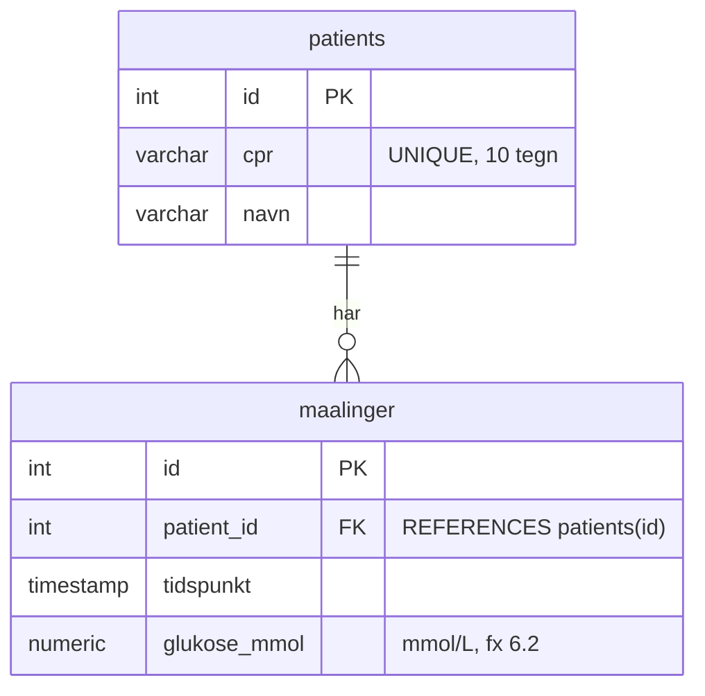

# Projektlog – Lektion 15 (database)

## ER-diagram

```mermaid
erDiagram
    patients ||--o{ maalinger : har
    patients {
        int id PK
        varchar cpr "UNIQUE, 10 tegn"
        varchar navn
    }
    maalinger {
        int id PK
        int patient_id FK "REFERENCES patients(id)"
        timestamp tidspunkt
        numeric glukose_mmol "mmol/L, fx 6.2"
    }
```
